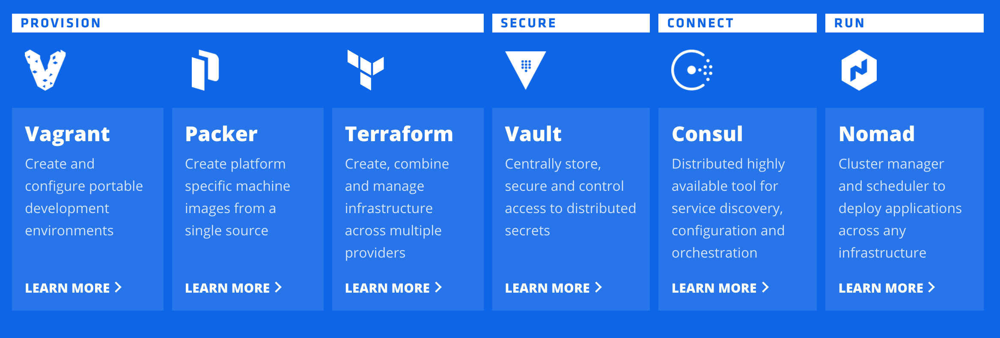

# Infras as code
1. Hashicorp's open Source Tools
   * https://www.hashicorp.com/open-source-tools/
   
      * Vagrant
         * https://www.vagrantup.com
      * Packer
         * https://www.packer.io
      * Terraform
         * https://www.terraform.io
      * Vault
         * https://www.vaultproject.io
      * Consul
         * https://www.consul.io
      * Nomad
         * https://www.nomadproject.io
1. Jenkins Job DSL
   * https://github.com/jenkinsci/job-dsl-plugin/wiki
      * Tutorial
        * https://github.com/jenkinsci/job-dsl-plugin/wiki/Tutorial---Using-the-Jenkins-Job-DSL
      * Commands
        * https://github.com/jenkinsci/job-dsl-plugin/wiki/Job-DSL-Commands
      * Jenkins core API
        * http://javadoc.jenkins-ci.org/
      * Read more
        * https://wiki.jenkins.io/display/JENKINS/Job+DSL+Plugin


# Packer
1. Build: 
    * `packer build packer.json`
1. Build AWS AMI: 
    * `packer build -var 'aws_access_key=XXXXXXXXXXXXX' -var 'aws_secret_key=XXXXXXXXXXXXX' packer_aws.json`
1. Document
   1. Builder
      * [Docker](https://www.packer.io/docs/builders/docker.html)


# Ansible 
## Document
   1. Generator
      * http://phansible.com/
   1. [Get started](http://docs.ansible.com/ansible/latest/intro_getting_started.html)

## Commands
1. Ping 
    ```
    ansible all -m ping -i hosts -u ec2-user --private-key ../XXXXXXXXXXXXX.pem
    113.172.116.208 | SUCCESS => {
        "changed": false,
        "ping": "pong"
    }
    ```
1. Run command
    ```
    ansible all -a "/bin/echo hello" -i hosts -u ec2-user --private-key ../XXXXXXXXXXXXX.pem
    113.172.116.208 | SUCCESS | rc=0 >>
    hello
    ```
1. Dry mode (checking mode)
    ```
    ansible-playbook ansible-aws.yml -i hosts -u ec2-user --private-key ../XXXXXXXXXXXXX.pem --check
    ```
1. Installing with playbook
    ```
    ansible-playbook ansible-aws.yml -i hosts -u ec2-user --private-key ../XXXXXXXXXXXXX.pem
    ```
1. Run with special hosts group (e.g:「ci」group)
    ```
    ansible ci -m ping -i hosts -u ec2-user --private-key ../XXXXXXXXXXXXX.pem
    ```
1. For short running command
    * `ansible-playbook ansible-aws.yml -i hosts --check # (No need specify -u and --private-key)` 
        * You must define host, user and key information in「hosts」file
            ```
            [ci]
            jenkins ansible_ssh_host=113.172.116.208 ansible_ssh_port=22 ansible_ssh_user=ec2-user ansible_ssh_private_key_file=~/XXXXXXXXXXXXX.pem
            ```
1. Syntax checking
    * `ansible-playbook ansible-aws.yml -i hosts --syntax-check`
1. Localhost installation running
    * `ansible-playbook /path/ansible-aws.yml -c local -i /path/hosts --check`
        * 「hosts」file contains: `127.0.0.1`
1. Running with extra vars 
    * `ansible-playbook /path/ansible-aws.yml --extra-vars ".........."`

# AWS
## CloudFormation
1. Create new stack: 
    * `aws cloudformation create-stack --stack-name XXXXXXXXXXXXX --template-body file:///$PWD/cloudformation.template`
1. Describe stack
    * `aws cloudformation describe-stack-events --stack-name "arn:aws:cloudformation:XXXXXXXXXXXXX"`
1. Delete stack
    * `aws cloudformation delete-stack --stack-name XXXXXXXXXXXXX`
1. Update stack
    * `aws cloudformation update-stack --stack-name XXXXXXXXXXXXX --template-body file:///$PWD/cloudformation.template`
1. Validate template
    * `aws cloudformation validate-template --template-body file:///$PWD/cloudformation.template`
1. Document
    1. [AWS Resource Types Reference](http://docs.aws.amazon.com/AWSCloudFormation/latest/UserGuide/aws-template-resource-type-ref.html)
        * [EC2](http://docs.aws.amazon.com/AWSCloudFormation/latest/UserGuide/aws-properties-ec2-instance.html)

## EC2
1. SSH
    * `ssh -i XXXXXXXXXXXXX.pem ec2-user@XXXXXXXXXXXXX`
## ECR (EC2 Container Register)
1. Login
    * `aws ecr get-login --region YOUR_REGION --registry-ids YOUR_ACCOUNT_ID`
        * Reference: http://docs.aws.amazon.com/general/latest/gr/rande.html#apigateway_region
1. Document
   * http://docs.aws.amazon.com/AmazonECR/latest/userguide/amazon_linux_container_image.html
# Docker
## Document
1. Generator
   * https://phpdocker.io/generator
## My images
1. amazonlinux
    * https://hub.docker.com/r/caophamtruongson/amazonlinux/
1. amazonlinux-ansible
    * https://hub.docker.com/r/caophamtruongson/amazonlinux-ansible/
1. nginx-sphinx-doc
    * https://hub.docker.com/r/caophamtruongson/nginx-sphinx-doc/
## Commands
1. Pull
   * `docker pull amazonlinux`
1. Run
   * `docker run -it amazonlinux:latest /bin/bash`
1. Run with volumes mapping
   * `docker run -it -v $(PWD):/packer-ansible caophamtruongson/amazonlinux-ansible:latest /bin/bash`
1. Creating image from running container
    * `docker commit 7d18148c2ef0 caophamtruongson/amazonlinux-XXXXXXXXXXXXX`
1. Push
   * `docker push caophamtruongson/amazonlinux`
1. Import image from「tar」file
    * `docker import docker_image.tar`
        * For checking, run: `docker images`, and checking the newest image        
        ```
        docker images
        REPOSITORY                                       TAG                 IMAGE ID            CREATED             SIZE
        <none>                                           <none>              4cb134cc72f2        About an hour ago   517 MB
        ```
# SSH 
1. How to set up ssh so you aren't asked for a password
   * https://www.debian.org/devel/passwordlessssh

# React
## My samples
1. Simple react
   * https://github.com/caophamtruongson/zfamilia_sample_react

# Third party
## Google

1. APIs and services Library
    * https://console.developers.google.com/apis/library
    * https://console.cloud.google.com/apis/library
    * https://developers.google.com/apis-explorer/?hl=en_US#p/
1. OAuth2 API
    * Getting access token from refresh token
        * https://www.googleapis.com/oauth2/v4/token
            * POST
                ```
                refresh_token:XXXXXXXXXX
                client_id:XXXXXXXXXX.apps.googleusercontent.com
                client_secret:XXXXXXXXXX
                redirect_uri:http://XXXXXXXXXX
                grant_type:refresh_token
                ```
1. Google Web Master
    * https://developers.google.com/webmaster-tools/search-console-api-original/
1. Google Search Console
    * Query Editor
        * https://developers.google.com/webmaster-tools/search-console-api-original/v3/searchanalytics/query#try-it
    * Usage Limits
        * https://developers.google.com/webmaster-tools/search-console-api-original/v3/limits
    * Query Reference
        * https://developers.google.com/webmaster-tools/search-console-api-original/v3/searchanalytics/query
    * Search Traffic document
        * https://support.google.com/webmasters/topic/4589099?hl=en&ref_topic=4558844
            * https://support.google.com/webmasters/answer/6155685?hl=en&ref_topic=4589099
    * What are impressions, position, and clicks?
        * https://support.google.com/webmasters/answer/7042828#position
    * Performance Tips
        * https://developers.google.com/webmaster-tools/search-console-api-original/v3/how-tos/performance
    * URL Crawl Errors Counts: query
        * https://developers.google.com/webmaster-tools/search-console-api-original/v3/urlcrawlerrorscounts/query

